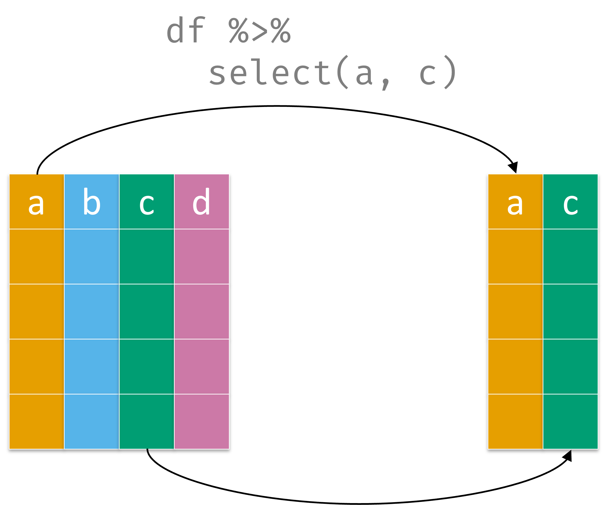
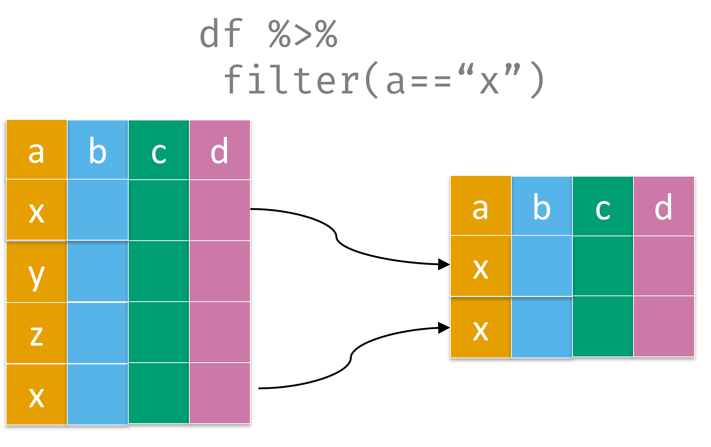
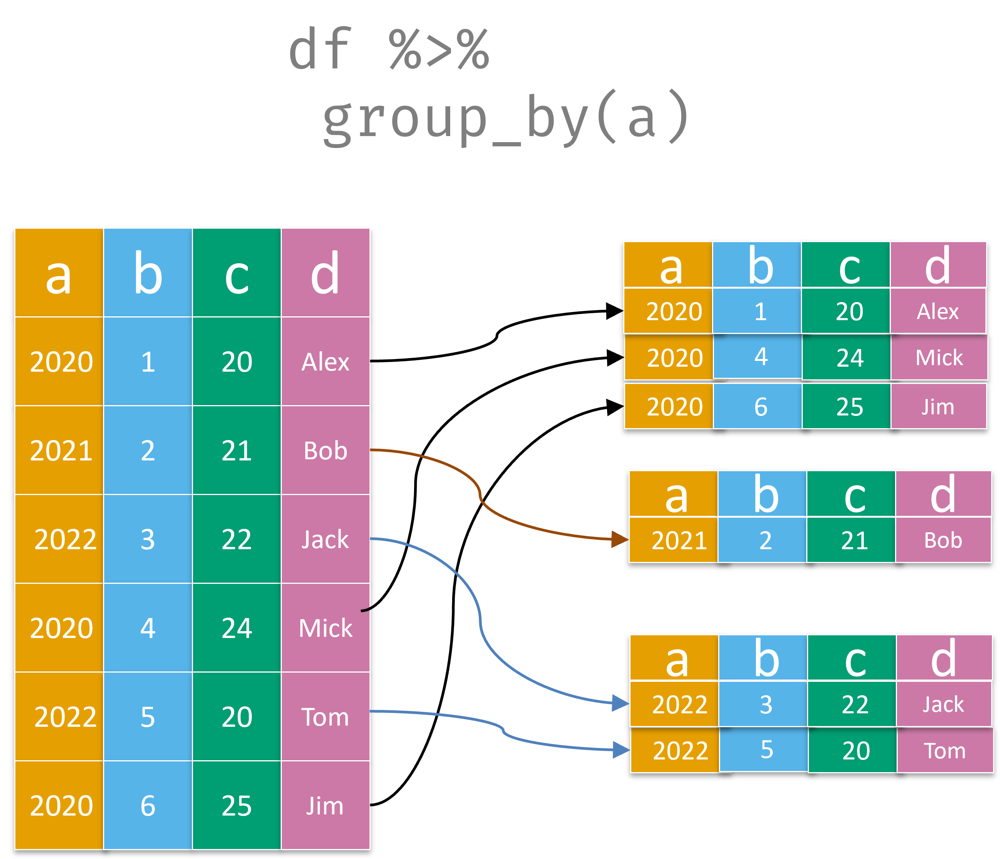
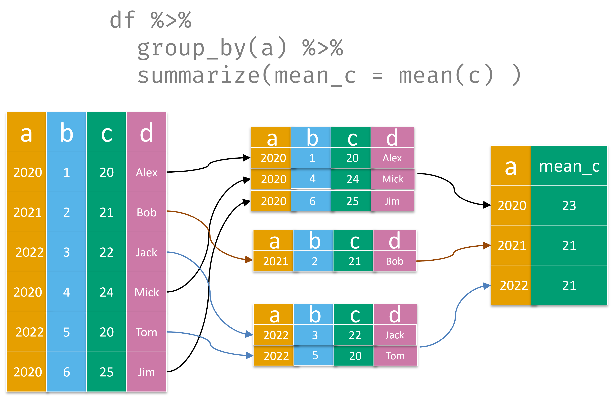
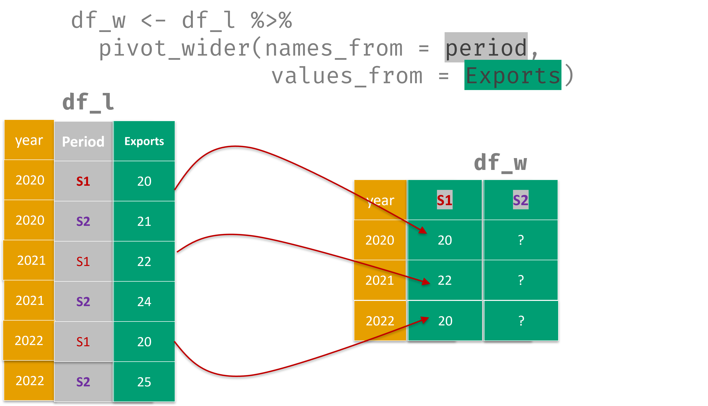
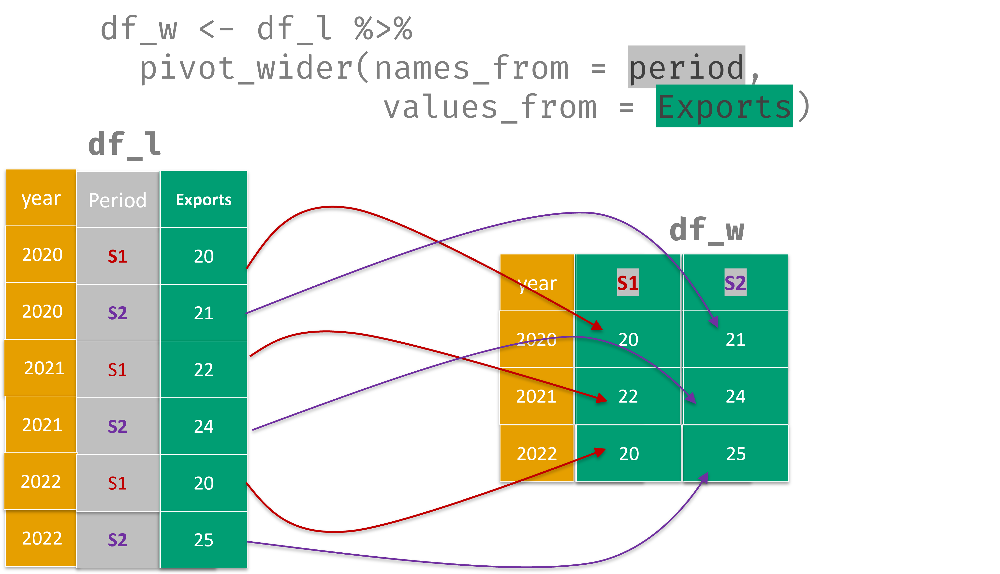

```{r setup, include=FALSE}
# In this chunk, all elements are loaded for the rest of the document!
library(learnr)
library(tidyverse)
library(stringr)
library(scales)

# ----- Load the pre-merged trade data -----
#
# Expected columns:
#   reporterCode, flowCode, flowCode2, partnerCode, geoAreaDescription,
#   cmdCode, cmd2Code, cmdCodeDescription, cmd2CodeDescription,
#   motCode, CIFValue, FOBValue, primaryValue


## We may work with a smaller data set

# tradedata_raw <- read.csv("./www/tradedata_ready.csv")
# trade_Asia <- tradedata_raw %>%
#   select(-c("X", "motCode")) %>%
#   filter(regional.grouping =="Asia")
# write.csv(trade_Asia, "www/tradeAsia.csv",row.names = FALSE)

tradedata <- read.csv("./www/tradeAsia.csv")
tradedata <- tradedata %>%
  relocate(flowCode2, geoAreaDescription, primaryValue, cmdCode, cmd2Code, cmd2CodeDescription)

# ----- Pre-computed objects used across multiple exercises -----

# Total trade by flow (used in Section 5 and the chart section)
table1 <- tradedata %>%
  group_by(flowCode2) %>%
  summarise(total_trade_value = sum(primaryValue / 1000000, na.rm = TRUE),
            .groups = "drop")

# Trade by partner country, wide format (used in Section 6)
table2 <- tradedata %>%
  group_by(geoAreaDescription, flowCode2) %>%
  summarise(Value = sum(primaryValue / 1000000, na.rm = TRUE),
            .groups = "drop") %>%
  rename(Area = geoAreaDescription) %>%
  pivot_wider(names_from = flowCode2, values_from = Value) %>%
  filter(Export >= 1000) %>%
  arrange(desc(Export)) %>%
  as.data.frame()

# Trade by 2-digit product, wide format (used in Section 7)
table3 <- tradedata %>%
  group_by(cmd2CodeDescription, flowCode2) %>%
  summarise(total_trade_value = sum(primaryValue / 1000000, na.rm = TRUE),
            .groups = "drop") %>%
  pivot_wider(names_from = flowCode2,
              values_from = total_trade_value,
              values_fill = 0) %>%
  slice_max(n = 20, order_by = Export) %>%
  arrange(desc(Export))
```


## Working with Trade Data in R

In this tutorial, we apply tidyverse tools to **International Merchandise Trade Statistics** from the UN Comtrade database.

The data has already been prepared for you with  country name, product labels, and a readable trade-flow indicator (`flowCode2`) are all merged into a single file. 

### Learning Objectives

At the end of this module you should be able to:

* Explore a trade dataset with `head()`, `names()`, and `str()`
* Select variables of interest with `select()`
* Filter observations by condition with `filter()`
* Aggregate trade values with `group_by()` and `summarise()`
* Reshape tables with `pivot_wider()`
* Produce a bar chart of trade flows with `ggplot2`

> *We highly recommend that you follow the order of the topics proposed in this tutorial!*

### Have you completed the R tutorials?

```{r quiz0, echo = FALSE}
question("Have you completed the Basic R! tutorial?  (*Check all that is TRUE*):",
  answer("Yes", correct = TRUE, message = "Perfect — the tidyverse tools you learned there apply directly here."),
  answer("No, I'm just starting here", message = "Please start with the basic Use R! course first, then come back.")
)
```


## The Trade Dataset

We have a dataset of international merchandise trade transactions (you will replace it with your own Comtrade file later).

Let's start by exploring it. Run the code below to see the first few rows:

```{r}
head(tradedata)
```

The dataset has **`r nrow(tradedata)`** observations and **`r ncol(tradedata)`** variables. It may happen that some variables have missing values for some observations (*e.g.* in  FOBValue)

> Use the arrow at the top right of the table to navigate across columns if they don't all fit on screen.

### Key variables:

Here are the most important columns you will work with:

| Variable | Description |
|---|---|
| `flowCode2` | Trade direction: `"Export"` or `"Import"` |
| `geoAreaDescription` | Partner country name |
| `primaryValue` | Trade value in USD |
| `cmdCode` | 6-digit HS commodity code |
| `cmd2Code` | 2-digit HS commodity code |
| `cmd2CodeDescription` | Description of the 2-digit HS commodity |

### Check your understanding

```{r quiz1, echo = FALSE}
quiz(
  question("What does one row in `tradedata` represent?",
    answer("A country", correct = FALSE),
    answer("A single trade transaction between the reporter and a partner country for one commodity",
           correct = TRUE,
           message = "Correct! Each row is one commodity-partner-flow combination."),
    answer("A yearly total of all exports", correct = FALSE),
    allow_retry = TRUE
  ),
  question("What values can `flowCode2` take?",
    answer('"X" and "M"', correct = FALSE,
           message = 'Those are the raw Comtrade codes. In our prepared file, they have been recoded.'),
    answer('"Export" and "Import"', correct = TRUE,
           message = "Yes — the `ifelse()` in the data preparation step recoded them for readability."),
    answer('"TRUE" and "FALSE"', correct = FALSE),
    allow_retry = TRUE
  )
)
```


## Step 1 — Explore with `select()`

The dataset has many columns. Often you only need a few.
The `select()` function lets you keep only the variables you want.

### Example:
Use `select()` to keep only the `a` and `c` variables in a given data frame `df`: 

{width=40%}


> **Your goal:** create a smaller data frame called `tradedata_light` that keeps only five columns:  
> `flowCode2`, `geoAreaDescription`, `cmd2CodeDescription`, `primaryValue`, and `cmdCode`.

```{r sel1-setup}
# tradedata is available
```

```{r sel1, exercise = TRUE, exercise.eval = FALSE, exercise.setup = "sel1-setup", exercise.cap = "Select 5 variables"}
# Enter your solution below
tradedata_light <-

  
```

```{r sel1-hint-1}
# Use select() and list the column names inside
tradedata_light <- tradedata %>%
  select( )
```

```{r sel1-hint-2}
# List each column name separated by a comma
tradedata_light <- tradedata %>%
  select(flowCode2, geoAreaDescription, )
```

```{r sel1-solution}
tradedata_light <- tradedata %>%
  select(flowCode2, geoAreaDescription, cmd2CodeDescription, primaryValue, cmdCode)
head(tradedata_light)
```

**Well done!** `tradedata_light` has the same number of rows but only **5 columns**.
This is much easier to work with when exploring trade patterns.

#### A bit of explanation:

- `select()` keeps only the columns you name — order matters, the result follows your list.
- You can also use `select(-column_name)` to *drop* a column instead.


## Step 2 — Filter exports with `filter()`

We often want to focus on just one direction of trade. The `filter()` function keeps only the rows that satisfy a condition.

### Example:
Use `filter()` to subset a data frame `df`  based on a logical condition: 

{width=50%}


> **Your goal:** starting from `tradedata`, create a new data frame called `exports` that contains **only export transactions**.  
> Recall that exports are identified by `flowCode2 == "Export"`.

```{r filt1-setup}
# tradedata is available
```

```{r filt1, exercise = TRUE, exercise.eval = FALSE, exercise.setup = "filt1-setup", exercise.cap = "Keep only exports"}
# Enter your solution below

exports <-

```

```{r filt1-hint-1}
# Use filter() with a logical condition on flowCode2
exports <- tradedata %>%
  filter( )
```

```{r filt1-hint-2}
# Remember: use == (double equals) for equality tests, and quote the string value
exports <- tradedata %>%
  filter(flowCode2 == "Export")
```

```{r filt1-solution}
exports <- tradedata %>%
  filter(flowCode2 == "Export")

nrow(exports)
```

**Congratulations!** Your `exports` data frame should contain roughly half the rows of the original dataset.

### Going further: combining conditions

You can combine multiple conditions inside `filter()` using `&` (AND) or `|` (OR).

> **Try it:** filter the data to keep only export transactions **with a primary value above 1 000 000 USD** (i.e. at least one million dollars).

```{r filt2, exercise = TRUE, exercise.eval = FALSE, exercise.cap = "Filter large exports"}
# Enter your solution below — combine two conditions with &
large_exports <-

```

```{r filt2-hint-1}
# Combine both conditions inside filter()
large_exports <- tradedata %>%
  filter(flowCode2 == "Export" & primaryValue > 1000000)
```

```{r filt2-solution}
large_exports <- tradedata %>%
  filter(flowCode2 == "Export" & primaryValue > 1000000)

nrow(large_exports)
```

### Check your understanding

```{r quiz2, echo = FALSE}
quiz(
  question("Which code correctly keeps only rows where `flowCode2` is Import?",
    answer('`filter(flowCode2 = "Import")`', correct = FALSE,
           message = "Single = is for assignment. Use == for comparison."),
    answer('`filter(flowCode2 == "Import")`', correct = TRUE,
           message = "Correct! Double == is the equality test in R."),
    answer('`select(flowCode2 == "Import")`', correct = FALSE,
           message = "`select()` picks columns, not rows. Use `filter()` for rows."),
    allow_retry = TRUE
  ),
  question("Does the order of filter() and select() matter in a pipeline?",
    answer("No, the result is always the same", correct = FALSE),
    answer("Yes — filter() first, then select() is the usual safe order",
           correct = TRUE,
           message = "Correct! If you select() first and drop a column you later need in filter(), the pipeline will fail."),
    allow_retry = TRUE
  )
)
```


## Step 3 — Aggregate with `group_by()` and `summarise()`

A key task in trade analysis is computing **total trade values** by group — for example, total  exports and total imports.


### Example:
`group_by()` splits data into groups so each group is handled separately by later steps. 

{width=60%}


The combination of `group_by()` + `summarise()` is very powerful for constructing a new data frame with a computed value per category (e.g. the mean):

{width=70%}

> **Your goal:** compute the total trade value (in **million USD**) for each trade flow (`flowCode2`).  
> Call the result `table1` and the new column `total_trade_value`.

```{r grp1-setup}
# tradedata is available
```

```{r grp1, exercise = TRUE, exercise.eval = FALSE, exercise.setup = "grp1-setup", exercise.cap = "Total trade by flow direction"}
# Enter your solution below

table1 <-

```

```{r grp1-hint-1}
# Start with group_by() to define the grouping variable
table1 <- tradedata %>%
  group_by(flowCode2) %>%

```

```{r grp1-hint-2}
# Use summarise() to compute the sum. Don't forget to divide by 1 000 000!
table1 <- tradedata %>%
  group_by(flowCode2) %>%
  summarise(total_trade_value = sum(primaryValue / 1000000, na.rm = TRUE),
            .groups = "drop")
```

```{r grp1-solution}
table1 <- tradedata %>%
  group_by(flowCode2) %>%
  summarise(total_trade_value = sum(primaryValue / 1000000, na.rm = TRUE),
            .groups = "drop")
table1
```

You should see two rows — one for Exports and one for Imports — with their total values in million USD.

#### A bit of explanation:

- `group_by(flowCode2)` tells R: *"from now on, treat each unique value of `flowCode2` as a separate group"*.
- `summarise()` then collapses each group down to a **single summary row**, computing whatever statistic you ask for.
- `na.rm = TRUE` makes sure missing values in `primaryValue` are ignored rather than making the whole sum `NA`.
- `.groups = "drop"` removes the grouping after summarising, which keeps the result clean.


## Step 4 — Trade by partner country

Now let's go deeper and compute total trade values **broken down by partner country**.

> **Your goal:** create `table2_long` — a summary of total export and import values (in million USD) for **each partner country** (`geoAreaDescription`), grouped also by `flowCode2`.  
> Name the value column `Value` and the country column `Area`.

```{r grp2-setup}
# tradedata is available
```

```{r grp2, exercise = TRUE, exercise.eval = FALSE, exercise.setup = "grp2-setup", exercise.cap = "Trade values by partner country (long format)"}
# Enter your solution below
table2_long <-

```

```{r grp2-hint-1}
# You need TWO grouping variables this time
table2_long <- tradedata %>%
  group_by(geoAreaDescription, flowCode2) %>%

```

```{r grp2-hint-2}
# After summarising, rename geoAreaDescription to Area
table2_long <- tradedata %>%
  group_by(geoAreaDescription, flowCode2) %>%
  summarise(Value = sum(primaryValue / 1000000, na.rm = TRUE),
            .groups = "drop") %>%
  rename(Area = geoAreaDescription)
```

```{r grp2-solution}
table2_long <- tradedata %>%
  group_by(geoAreaDescription, flowCode2) %>%
  summarise(Value = sum(primaryValue / 1000000, na.rm = TRUE),
            .groups = "drop") %>%
  rename(Area = geoAreaDescription)
head(table2_long)
```

This gives a **long-format** table: each country appears twice (once for Export, once for Import).


## Step 5 — Reshape with `pivot_wider()`

The long format is great for `ggplot2`, but for a readable summary **table** it is more convenient to have Exports and Imports as **separate columns** — one row per country.

This is called **wide format**, and `pivot_wider()` does the reshaping.

### Example:
Use `pivot_wider()` to transform a ***long*** data frame `df_l`  into a ***wide***  `df_w` : 

- Step1: Create the structure of the wide data frame with columns `year` `S1` and `S2`. The columns `period` and `Exports` will disappear.

{width=60%}

- Step2: Collect the corresponding values from `df` 

{width=60%}

We can observe that all 6 values from `Exports` in the long `df` are correctly reported in the wide  `df_w`.


> **Your goal:** starting from `table2_long` (created above), create `table2` in wide format:  
> - Columns: `Area`, `Export`, `Import`  
> - Filter to keep only countries with `Export >= 1000` (million USD)  
> - Arrange in descending order of `Export`


```{r pivot-setup}

# table2_long is available (pre-computed version)
table2_long <- tradedata %>%
  group_by(geoAreaDescription, flowCode2) %>%
  summarise(Value = sum(primaryValue / 1000000, na.rm = TRUE),
            .groups = "drop") %>%
  rename(Area = geoAreaDescription)
```

```{r pivot1, exercise = TRUE, exercise.eval = FALSE, exercise.setup = "pivot-setup", exercise.cap = "Pivot to wide format and filter top partners"}
# Enter your solution below
table2 <-

```

```{r pivot1-hint-1}
# pivot_wider() needs to know which column gives the new column names,
# and which column gives the values
table2 <- table2_long %>%
  pivot_wider(names_from = flowCode2, values_from = Value)
```

```{r pivot1-hint-2}
# Then add filter() and arrange() in the pipeline
table2 <- table2_long %>%
  pivot_wider(names_from = flowCode2, values_from = Value) %>%
  filter(Export >= 1000) %>%
  arrange(desc(Export))
```

```{r pivot1-solution}
table2 <- table2_long %>%
  pivot_wider(names_from = flowCode2, values_from = Value) %>%
  filter(Export >= 1000) %>%
  arrange(desc(Export)) %>%
  as.data.frame()

head(table2)
```

**This is `table2`** — the main partner-country summary table. You can see at a glance which countries are the largest export destinations.

### Check your understanding

```{r quiz3, echo = FALSE}
quiz(
  question("What does `pivot_wider()` do?",
    answer("It adds more rows to the data frame", correct = FALSE),
    answer("It turns unique values of one column into new column names",
           correct = TRUE,
           message = "Exactly! Each unique value of the column identified in  `names_from = `  becomes a column."),
    answer("It filters rows by a condition", correct = FALSE),
    allow_retry = TRUE
  ),
  question("If `filter(Export >= 1000)` comes BEFORE `pivot_wider()`, will the code work?",
    answer("Yes, the result is identical",
           correct = FALSE,
           message = "Not quite — the column `Export` does not exist yet before `pivot_wider()` creates it!"),
    answer("No — the column `Export` doesn't exist yet in long format",
           correct = TRUE,
           message = "Correct. You must pivot first, then filter on the new columns."),
    allow_retry = TRUE
  )
)
```


## Step 6 — Trade by product (2-digit HS)

Let's now aggregate by **product category** using the 2-digit HS code description.

> **Your goal:** create `table3` — total export and import values by `cmd2CodeDescription`, in **wide format**, keeping the **top 20 product categories** by export value.

```{r prod-setup}
# tradedata is available
```

```{r prod1, exercise = TRUE, exercise.eval = FALSE, exercise.setup = "prod-setup", exercise.cap = "Trade by 2-digit HS product (wide format, top 20)"}
# Enter your solution below

table3 <-

```

```{r prod1-hint-1}
# Start with group_by on cmd2CodeDescription and flowCode2
table3 <- tradedata %>%
  group_by(cmd2CodeDescription, flowCode2) %>%
  summarise(total_trade_value = sum(primaryValue / 1000000, na.rm = TRUE),
            .groups = "drop")
```

```{r prod1-hint-2}
# Then pivot to wide, fill missing combinations with 0,
# and keep only the top 20 by export value
table3 <- tradedata %>%
  group_by(cmd2CodeDescription, flowCode2) %>%
  summarise(total_trade_value = sum(primaryValue / 1000000, na.rm = TRUE),
            .groups = "drop") %>%
  pivot_wider(names_from = flowCode2,
              values_from = total_trade_value,
              values_fill = 0) %>%
  slice_max(n = 20, order_by = Export) %>%
  arrange(desc(Export))
```

```{r prod1-solution}
table3 <- tradedata %>%
  group_by(cmd2CodeDescription, flowCode2) %>%
  summarise(total_trade_value = sum(primaryValue / 1000000, na.rm = TRUE),
            .groups = "drop") %>%
  pivot_wider(names_from = flowCode2,
              values_from = total_trade_value,
              values_fill = 0) %>%
  slice_max(n = 20, order_by = Export) %>%
  arrange(desc(Export))
head(table3, 10)
```

#### A bit of explanation:

- `values_fill = 0` fills in `0` when a product category has no recorded exports or imports (instead of `NA`).
- `slice_max(n = 20, order_by = Export)` keeps only the top 20 rows by export value — a handy alternative to `arrange() %>% head(20)`.

> **What are your country's top export products?**


## Step 7 — Visualise with `ggplot2`

Tables are informative, but a chart communicates patterns much faster. Let's build a **horizontal bar chart** showing exports and imports for the **top 10 partner countries**.

We first need to convert `table2` back to **long format** for `ggplot2` (which works best with long data), keeping only the top 10 countries by export value.

The reshaping is done for you below — your task is to complete the `ggplot2` call.

```{r chart-setup}
# table2 is pre-computed and available here

# Reshape top 10 to long format
table2_long_top10 <- table2 %>%
  slice_max(order_by = Export, n = 10) %>%
  pivot_longer(cols = c(Export, Import),
               names_to = "trade_flow",
               values_to = "total_trade_value") %>%
  arrange(desc(total_trade_value))
```

```{r chart1, exercise = TRUE, exercise.eval = FALSE, exercise.setup = "chart-setup", exercise.cap = "Bar chart of trade flows by partner country"}
# table2_long_top10 is ready to use.
# Complete the ggplot call below:

ggplot(table2_long_top10,
       aes(x = fct_reorder(Area, total_trade_value, sum),
           y = total_trade_value,
           fill = trade_flow)) +
  geom_col(position = position_dodge(width = 0.9)) +
  coord_flip() +
  labs(
    title = "Trade flows by top 10 partner countries (million USD)",
    x = "Partner country",
    y = "Value (million USD)",
    fill = "Trade flow"
  ) +
  theme_minimal()
```

```{r chart1-hint-1}
# The code above is already complete — press Run Code to see the chart!
# Then try changing the title, or replacing theme_minimal() with theme_bw().
```

```{r chart1-solution}
ggplot(table2_long_top10,
       aes(x = fct_reorder(Area, total_trade_value, sum),
           y = total_trade_value,
           fill = trade_flow)) +
  geom_col(position = position_dodge(width = 0.9)) +
  coord_flip() +
  labs(
    title = "Trade flows by top 10 partner countries (million USD)",
    x = "Partner country",
    y = "Value (million USD)",
    fill = "Trade flow"
  ) +
  theme_minimal()
```

#### A bit of explanation:

- `fct_reorder(Area, total_trade_value, sum)` reorders countries on the y-axis by their **total** trade value (exports + imports combined), so the chart reads from largest to smallest.
- `position_dodge(width = 0.9)` places Export and Import bars **side by side** rather than stacked.
- `coord_flip()` rotates the chart so country names appear on the y-axis — much easier to read than angled x-axis labels!

> **Now try it for products:** can you adapt this code to plot the top 10 products from `table3`?

```{r chart2, exercise = TRUE, exercise.eval = FALSE, exercise.cap = "Your turn: bar chart by product"}
# Adapt the chart above to show the top 10 product categories
# Hint: start from table3, pivot_longer(), then ggplot()

```

```{r chart2-hint-1}
# Step 1: reshape table3 to long format
table3_long <- table3 %>%
  slice_max(order_by = Export, n = 10) %>%
  pivot_longer(cols = c(Export, Import),
               names_to = "trade_flow",
               values_to = "total_trade_value")
```

```{r chart2-hint-2}
# Step 2: use the same ggplot structure, replacing Area with cmd2CodeDescription
ggplot(table3_long,
       aes(x = fct_reorder(cmd2CodeDescription, total_trade_value, sum),
           y = total_trade_value,
           fill = trade_flow)) +
  geom_col(position = position_dodge(width = 0.9)) +
  coord_flip() +
  labs(title = "Trade flows by top 10 product categories (million USD)",
       x = "Product", y = "Value (million USD)", fill = "Trade flow") +
  theme_minimal()
```

```{r chart2-solution}
table3_long <- table3 %>%
  slice_max(order_by = Export, n = 10) %>%
  pivot_longer(cols = c(Export, Import),
               names_to = "trade_flow",
               values_to = "total_trade_value")

ggplot(table3_long,
       aes(x = fct_reorder(cmd2CodeDescription, total_trade_value, sum),
           y = total_trade_value,
           fill = trade_flow)) +
  geom_col(position = position_dodge(width = 0.9)) +
  coord_flip() +
  labs(title = "Trade flows by top 10 product categories (million USD)",
       x = "Product", y = "Value (million USD)", fill = "Trade flow") +
  scale_x_discrete(labels = function(x) str_wrap(str_trunc(x, 40), width = 30)) +
  theme_minimal()
```


## Conclusion

> This tutorial is just the beginning!

You have applied core `tidyverse` tools to **trade statistics**  with the following functions:

- `select()` to focus on relevant variables
- `filter()` to subset by trade flow or value threshold
- `group_by()` + `summarise()` to aggregate trade values
- `pivot_wider()` to reshape from long to wide format
- `ggplot2` to visualise trade patterns by partner and product

These are the building blocks for a full analysis.

###  Where to go from here?

* **Practice** on real datasets from your institution. Start simple and with a clear goal.
* **Collaborate** by sharing scripts, or with coding sessions of *pair programming*^[In **pair programming** two persons work together on just one computer, meaning they work simultaneously (one typing , one reading) on a code. this is a very efficient way of learning ([more here](https://en.wikipedia.org/wiki/Pair_programming)).]
* **Explore** the web to find examples and code similar to what you want to do. Then reuse and tweak the code to your needs. 
* **Continue learning** through platforms like [R for Data Science](https://r4ds.had.co.nz/), [Posit recipes](https://posit.cloud/learn/recipes), and  [A ModernDive into R and the Tidyverse](https://moderndive.com/) among many useful references. You can also use *ChatGPT* to help you with some simple requests and code debugging. Be careful though of mistakes, fake packages and confidential information. 

### Another **R** is possible

In this tutorial, we focused on the **tidyverse** approach to R,  not because base R isn’t powerful, but because **tidyverse** offers a clearer, more consistent, and beginner-friendly grammar for working with data. This modern toolkit helps you think in terms of data pipelines (with `%>%` or `|>`), making your code easier to read, share, and scale across projects. 

With time, you'll learn how to code with R core functions and language. Don't be afraid, what you have learned here with the **tidyverse** will still help you!   

> Good luck! 


---

### References

UN Comtrade Database: [https://comtradeplus.un.org](https://comtradeplus.un.org)

Wickham, H. & Grolemund, G. (2017). *R for Data Science*. O'Reilly. [https://r4ds.had.co.nz](https://r4ds.had.co.nz)

Posit Primers — interactive tidyverse tutorials: [https://posit.cloud/learn/primers](https://posit.cloud/learn/primers)

---

<p xmlns:cc="http://creativecommons.org/ns#" xmlns:dct="http://purl.org/dc/terms/"><span property="dct:title">This tutorial</span> by <span property="cc:attributionName">Christophe Bontemps & Chesca Rosales (SIAP)</span> is licensed under <a href="http://creativecommons.org/licenses/by-nc-sa/4.0/?ref=chooser-v1" target="_blank" rel="license noopener noreferrer" style="display:inline-block;">CC BY-NC-SA 4.0</a></p>
